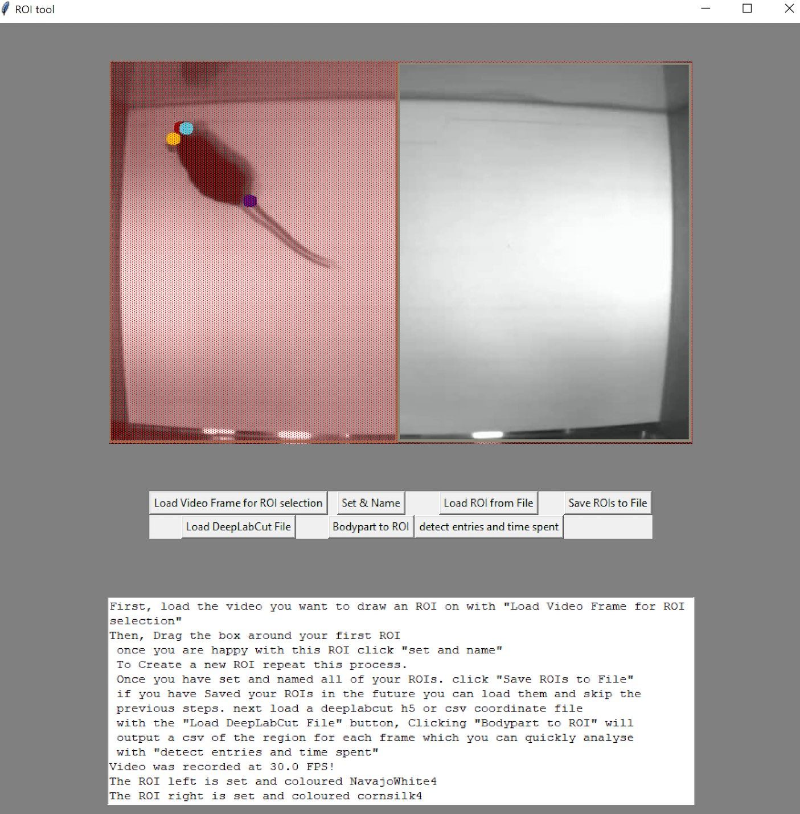

# DLC ROI tool
A tool for drawing regions of interest (ROIs) on videos and analysing DeepLabCut videos.

__We currently do not support multi-animal but will in the future!__

## Installation
Install the requirements from the YAML file with:
```bash
$ conda env create -f ROI_ENV.yml
```
The main one is that it requires pandas to not be on version 1.x. We use `pandas=0.25.3` :).





## Launching the GUI

```bash
#Clone this repository
$ git clone https://github.com/PolarBean/DLC_ROI_tool.git
#Change you current directory to the repo's
$ cd DLC_ROI_tool
#Run the GUI!
$ python ROI_tool.py
```


## The DLC-ROI Process

### Step 1. Choose a Video
When you initially launch the application, you will be asked to choose a video on which to draw your ROI.

### Step 2. Draw Your ROIs
Click and drag to draw your ROIs and save them sequentially with `Set and Name.`

### Step 3. Load DeepLabCut File
Choose a scored DeepLabCut file (this should work with either the CSV or .h5 file, but I usually use the .h5).
This doesn't necessarily need to be the same video that you drew the ROI on, drawing the ROI set the XY coordinates of each ROI, and it will apply these coordinates to any DLC file you choose. If your ROIs don't move from video to video, this can be efficient. 

### Step 4. BodyPart to ROI
This is a necessary step and generates a CSV with the ROI an animal was in for each frame of the scored DLC video. It uses a majority method to determine where the majority of the animal was in any given frame. This can take a long time, especially with long or high fps videos, so if the application is not responding, just let it think for a minute or 3 :).

### Step 5. Detect Entries and Time Spent
This will quickly generate you a CSV file with basic stats on your videos, such as time spent and the number of entries into each ROI and between ROIs. 

### Optional. Save ROIs for Future Analysis
The `Save ROIs to file` allows you to save your defined ROIs to a CSV file, which can be loaded later to allow for consistency and replication of your analysis.
